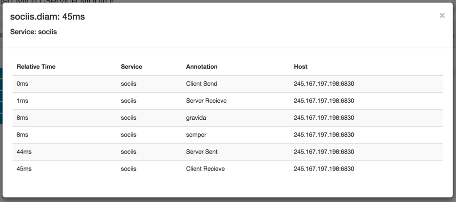

#### Demo Environment ####

You need to have [Vagrant](https://www.vagrantup.com/) and [Ansible](http://www.ansible.com/) already installed.

```
$> git clone https://github.com/varnish/varnish-microservice-monitor.git

$> cd varnish-microservice-monitor/provisioning`

$> vagrant up`

$> ansible-playbook playbook.yml
```

Once the above task finish you would be able to see the user interface on: [http://192.168.33.11:5000/](http://192.168.33.11:5000/)

#### Presentation ####
[Varnish Microservices 2.0](http://www.slideshare.net/Varnish_software/microservices-20)

#### Screenshots ####

Lookup


Search Results


Annotations


#### System Level View ####

A system level view of how everything comes together.


#### User Interface ####

User interface will use the UI files (styles, scripts and templates) from ZipKin.

[Link to UI](ui/)

#### Code Documentation ####

* [Varnish API](docs/code/Varnish API.md)
* [Headers](docs/code/Headers.md)
* [Reader](docs/code/Reader.md)
* [Data Manager](docs/code/Data Manager.md)
* [Buffer](docs/code/Buffer.md)
* [Storage](docs/code/Storage.md)

#### Next Steps ####

1. Mimic data flow with parent headers etc. just as zip kin uses inside you application.
2. Make the application function as close to ZipKin as possible.
3. Use ZipKin user-interface to display information.
4. Document functionality implemented. The flow of the system.

#### Tracking Micro-Services via Varnish Cache ####

Running ``./script.sh`` should start a web-server on port 8080

Track timing of micro-service requests by passing micro-service requests through a varnish server.

Varnish Cache would run on port **6081** by default. The default.vcl file connects to port **9000** for backend requests. Modify default.vcl file to ``return (pass);`` from vcl_recv sub routine.

* [Configuring JDK](docs/Configuring JDK.md)
* [ZipKin](docs/ZipKin.md)
* [Creating Services](docs/RPC Services.md)
  * [Example Service](docs/Example Service.md)
    * [Bash Script](script.sh)
     * be sure to change chmod +x script.sh, so you can run it as ``$> ./script.sh``
* [Structure of ZipKin tables and generating false data](docs/False data.md)
* [ZipKin and Varnishlog headers](docs/ZipKin and Varnishlog headers.md)
* [Varnish Logger](docs/Varnish Logger.md)


##### Machine Used #####

Debian 8.1 / **specifically** Linux debian 3.16.0-4-amd64 #1 SMP Debian 3.16.7-ckt9-3~deb8u1 (2015-04-24) x86_64 GNU/Linux
