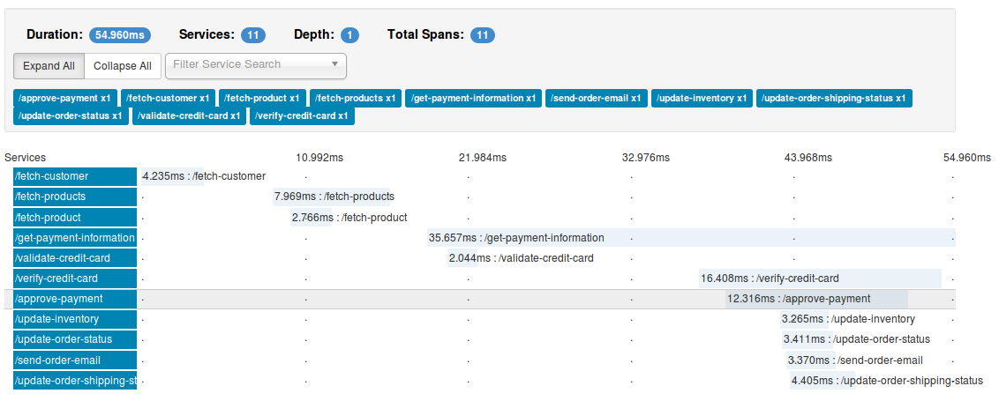

## Services Logging Result ##

Below shows an expanded overview of services calls in call chain.

## Next Steps ##

1. Mimic data flow with parent headers etc. just as zip kin uses inside you application.
2. Make the application function as close to ZipKin as possible.
3. Use ZipKin user-interface to display information.
4. Document functionality implemented. The flow of the system.

## Tracking Micro-Services via Varnish Cache ##

Running ``./script.sh`` should start a web-server on port 8080

Track timing of micro-service requests by passing micro-service requests through a varnish server.

Varnish Cache would run on port **6081** by default. The default.vcl file connects to port **9000** for backend requests. Modify default.vcl file to ``return (pass);`` from vcl_recv sub routine.

* [Configuring JDK](docs/Configuring JDK.md)
* [ZipKin](docs/ZipKin.md)
* [Creating Services](docs/RPC Services.md)
  * [Example Service](docs/Example Service.md)
    * [Bash Script](script.sh)
     * be sure to change chmod +x script.sh, so you can run it as ``$> ./script.sh``
* [Structure of ZipKin tables and generating false data](docs/False data.md)
* [ZipKin and Varnishlog headers](docs/ZipKin and Varnishlog headers.md)
* [Varnish Logger](docs/Varnish Logger.md)

#### Machine Used ####

Debian 8.1 / **specifically** Linux debian 3.16.0-4-amd64 #1 SMP Debian 3.16.7-ckt9-3~deb8u1 (2015-04-24) x86_64 GNU/Linux
